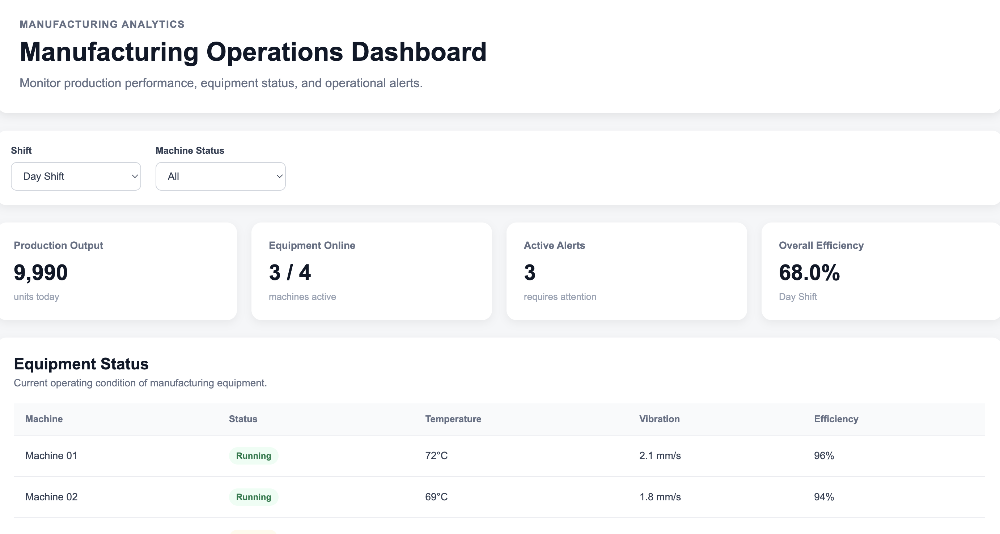

# Manufacturing Operations Dashboard

A full-stack manufacturing analytics dashboard designed to monitor production performance, equipment health, operational efficiency, and manufacturing alerts.

The application uses a React + TypeScript frontend, an Express.js REST API, and PostgreSQL for persistent manufacturing data storage.



## Features

- Real-time-style manufacturing operations dashboard
- Equipment status monitoring
- Production output visualization
- Machine temperature and vibration monitoring
- Equipment efficiency tracking
- Operational alert monitoring
- Machine status filtering
- Shift selection
- Dynamic KPI calculations
- REST API integration
- PostgreSQL database integration
- Responsive dashboard interface

## Technology Stack

### Frontend

- React
- TypeScript
- Vite
- Recharts
- CSS

### Backend

- Node.js
- Express.js
- REST API
- CORS
- PostgreSQL `pg` client

### Database

- PostgreSQL
- Docker

### Development Tools

- Git
- GitHub
- VS Code
- Chrome DevTools
- Docker Desktop

## System Architecture

```text
React + TypeScript Frontend
          |
          | HTTP / REST API
          v
Node.js + Express Backend
          |
          | SQL Queries
          v
PostgreSQL Database
          |
          v
Manufacturing Data
```

The frontend retrieves manufacturing information from the Express API.

The Express backend communicates with PostgreSQL and exposes data through REST API endpoints.

## Dashboard KPIs

The dashboard provides several manufacturing KPIs:

- Production Output
- Equipment Online
- Active Alerts
- Overall Equipment Efficiency

These metrics are calculated using production and equipment data retrieved by the application.

## Equipment Monitoring

The equipment table provides operational information for each machine, including:

| Metric | Description |
|---|---|
| Machine | Equipment identifier |
| Status | Running, Warning, or Offline |
| Temperature | Current operating temperature |
| Vibration | Machine vibration measurement |
| Efficiency | Current machine efficiency |

Status indicators make it easy to identify machines requiring attention.

## Production Performance

Production output is visualized using an interactive Recharts line chart.

The chart displays hourly production output and helps identify:

- Production trends
- Output changes
- Performance fluctuations
- Shift-level manufacturing performance

## Operational Alerts

The dashboard displays manufacturing alerts such as:

- High machine temperature
- Excessive vibration
- Equipment offline conditions

Alerts are categorized by severity to help identify equipment requiring immediate attention.

## REST API

The Express backend exposes REST API endpoints used by the frontend.

```text
GET /api/machines
GET /api/production
GET /api/alerts
GET /api/health
```

### Example Machine Response

```json
{
  "name": "Machine 01",
  "status": "Running",
  "temperature": 72,
  "vibration": 2.1,
  "efficiency": 96
}
```

## PostgreSQL Database

Manufacturing equipment data is stored in PostgreSQL.

Example table structure:

```sql
CREATE TABLE machines (
    id SERIAL PRIMARY KEY,
    name VARCHAR(100) NOT NULL,
    status VARCHAR(20) NOT NULL,
    temperature DECIMAL(5,2),
    vibration DECIMAL(5,2),
    efficiency DECIMAL(5,2) NOT NULL
);
```

Example data:

```sql
INSERT INTO machines
(name, status, temperature, vibration, efficiency)
VALUES
('Machine 01', 'Running', 72, 2.1, 96),
('Machine 02', 'Running', 69, 1.8, 94),
('Machine 03', 'Warning', 91, 4.7, 82),
('Machine 04', 'Offline', NULL, NULL, 0);
```

## Running the Project Locally

### 1. Clone the repository

```bash
git clone <your-repository-url>
cd manufacturing-operations-dashboard
```

### 2. Install frontend dependencies

```bash
npm install
```

### 3. Start the frontend

```bash
npm run dev
```

The frontend runs on:

```text
http://localhost:5173
```

### 4. Install backend dependencies

Open another terminal:

```bash
cd backend
npm install
```

### 5. Start the backend

```bash
node server.js
```

The backend runs on:

```text
http://localhost:3001
```

### 6. Verify the API

Test:

```text
http://localhost:3001/api/health
```

You should receive a response indicating that the Manufacturing API is running.

## Project Structure

```text
manufacturing-operations-dashboard/
│
├── backend/
│   ├── server.js
│   ├── package.json
│   └── package-lock.json
│
├── public/
│
├── screenshots/
│   └── dashboard.png
│
├── src/
│   ├── App.tsx
│   ├── App.css
│   └── main.tsx
│
├── .gitignore
├── package.json
├── package-lock.json
├── README.md
├── tsconfig.json
└── vite.config.ts
```

## Future Improvements

Potential improvements include:

- Real-time machine telemetry using WebSockets
- Historical production analytics
- Predictive maintenance models
- Machine downtime analysis
- OEE calculations
- Additional manufacturing KPIs
- User authentication
- Role-based dashboard access
- Cloud deployment
- Automated CI/CD pipeline

## Purpose

This project demonstrates practical full-stack development and data engineering concepts including:

- React dashboard development
- TypeScript
- REST API development
- Node.js and Express
- PostgreSQL
- SQL
- Docker
- Data visualization
- API integration
- Git and GitHub workflow
- Manufacturing analytics

## Author

**Jaideep**

Full-Stack / Data / AI-ML Engineering Portfolio Project